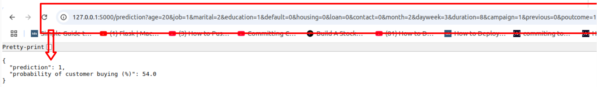
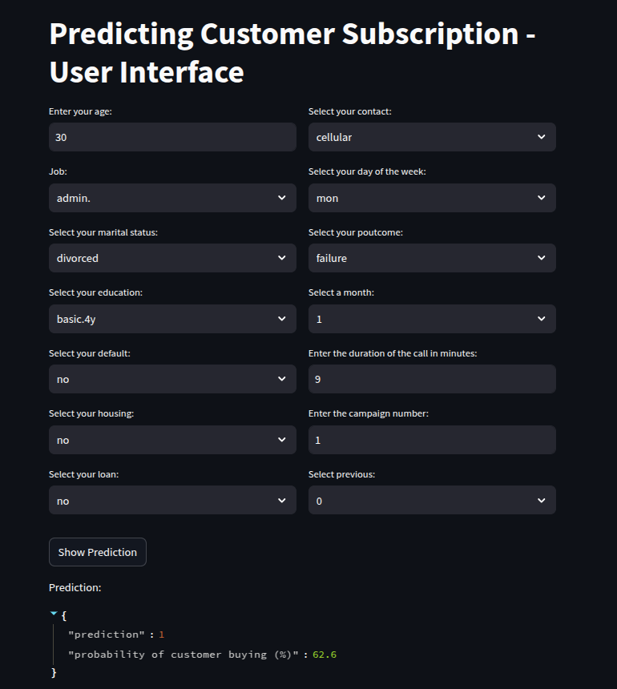

This is the repository corresponding to the task "Predicting customer subscription".

In this repository you can find 3 relevant folders:

1) Jupyter_notebook: here I solved the proposed task in a notebook. The final "predictions.csv" file with the predictions is stored in the folder "data".

2) API_Flask: developed as an extra task. I took the resulting model from point 1 and created an API in Flask in order to simulate a "virtual production" environment. The idea is using the trained model for performing predictions programatically by means of GET calls. Type "python app.py" to execute.

3) APP_Streamlit: developed as an extra task. I created a dashboard so that the bank workers could easily get a prediction about the posibilities of subscription of a customer by typing the parameters in drop down menus and input boxes. I have used the library "Streamlit" which comes in hand for creating quick using interfaces with python. The predictions are obtained by means of backend calls to the API developed in the second point. Type "streamlit run app.py" to execute (the API needs to be working to get the predictions).

Notes about the set up: the task has been developed in an Ubuntu OS using an anaconda environment and VS Code as an IDE. The models have been trained locally using a Nvidia GEFORCE RTX GPU graphic card and have been gitignored for repository size reasons.